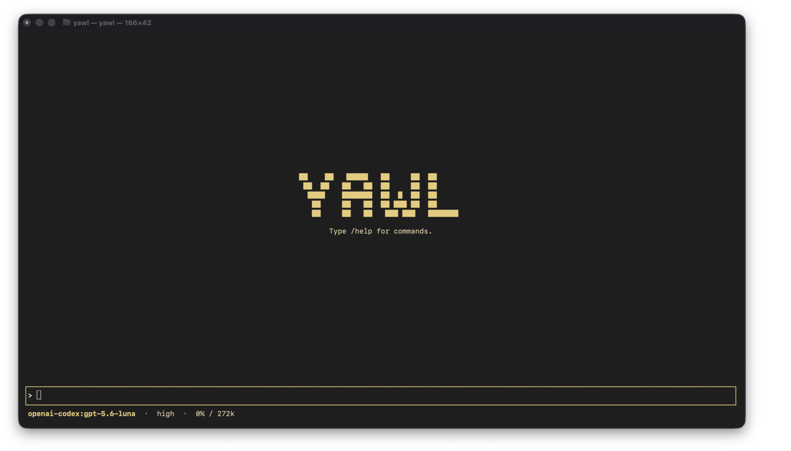
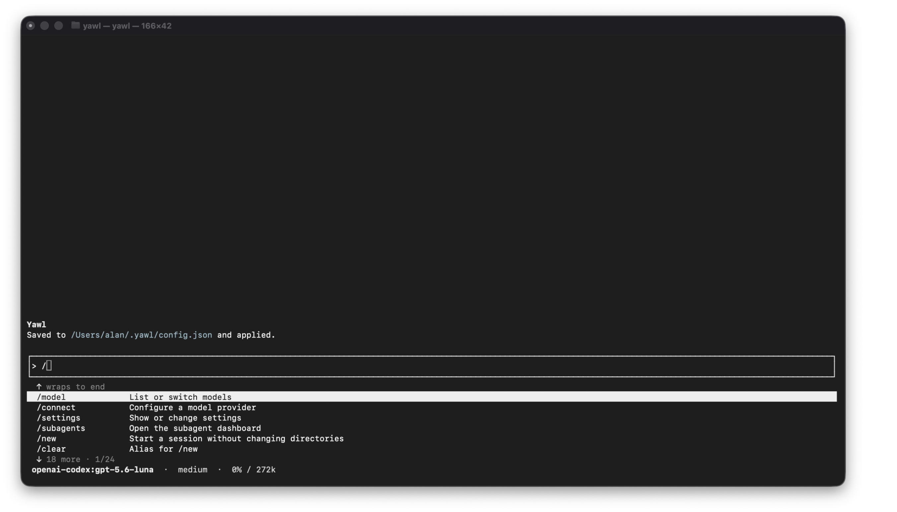
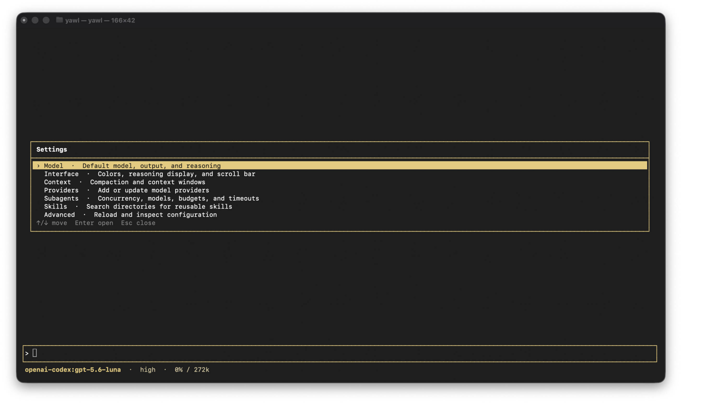
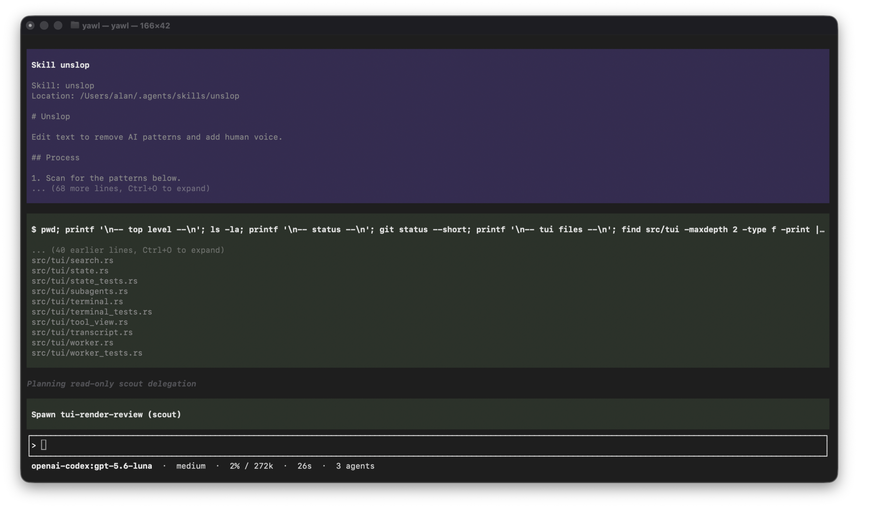
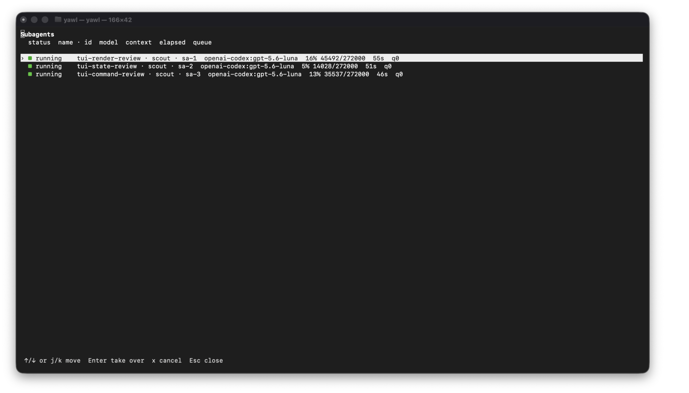
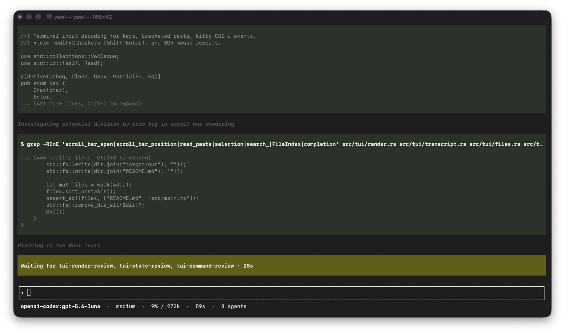
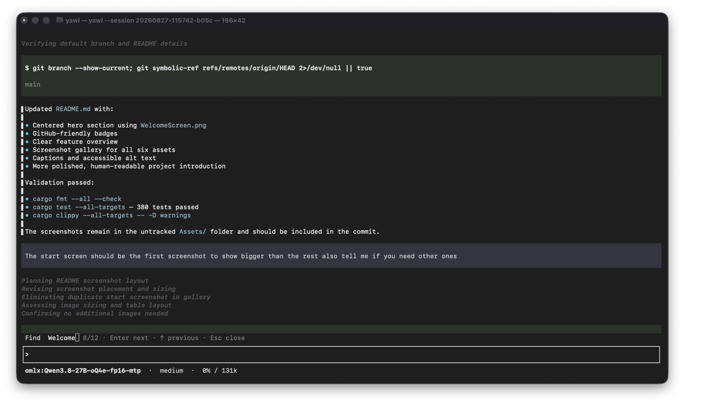

# Yawl

<div align="center">
  
  <p><sub>The welcome screen, shown first and at full size.</sub></p>
  <p>
    <strong>A small AI coding harness that stays in your terminal.</strong><br>
    Stream answers, run tools, keep sessions, and bring your own model.
  </p>
  <p>
    <a href="https://github.com/alan13367/yawl/blob/main/LICENSE"></a>
    
    
  </p>
</div>

Yawl is a small AI agent runner for macOS and Linux. It gives you a full-screen terminal interface, a scriptable print mode, provider selection, persistent sessions, tool calling, and automatic context compaction.

The model can add tools without recompiling Yawl. Put an executable in `~/.yawl/tools/` or `./.yawl/tools/`, implement the exec-tool contract, and Yawl discovers it before the next model step. Optional built-in web search and page fetching can be enabled in settings.

## What you get

- **A focused terminal UI.** Browse the transcript, inspect tool calls, search history, edit queued prompts, and copy responses without leaving the terminal.
- **The provider you already use.** Connect Anthropic, OpenAI, OpenAI Codex, Ollama, LM Studio, OMLX, or any compatible OpenAI endpoint.
- **Tools that can grow with the project.** The built-in file and shell tools are joined by executable tools you add locally.
- **Skills with an explicit trust boundary.** Project instructions and Markdown skills remain disabled until you trust their source.
- **Parallel work when you need it.** Start subagents, watch them in the dashboard, take over a child, or cancel one without losing the main conversation.
- **Sessions that remain useful.** Resume a conversation later, compact old context when it grows, and use `/undo` for changes made through Yawl's file tools.

## Screenshots

The interface is intentionally dense without being noisy. These are real views from the terminal UI.

<table>
  <tr>
    <td width="50%" align="center">
      
      <br><sub><b>Commands and skills</b><br>Type <code>/</code> to search commands and skills.</sub>
    </td>
    <td width="50%" align="center">
      
      <br><sub><b>Settings</b><br>Change model, appearance, context, providers, and subagents.</sub>
    </td>
  </tr>
  <tr>
    <td width="50%" align="center">
      
      <br><sub><b>Skills in the loop</b><br>Load focused instructions when a task calls for them.</sub>
    </td>
    <td width="50%" align="center">
      
      <br><sub><b>Subagent dashboard</b><br>See parallel runs, their status, and their token use.</sub>
    </td>
  </tr>
  <tr>
    <td width="50%" align="center">
      
      <br><sub><b>Waiting on parallel work</b><br>Keep the main turn visible while children finish.</sub>
    </td>
    <td width="50%" align="center">
      
      <br><sub><b>Search with <code>Ctrl+F</code></b><br>Find anything in the transcript without losing your place.</sub>
    </td>
  </tr>
</table>

## Install

Yawl requires Rust 1.98.0 or newer.

```sh
git clone https://github.com/alan13367/yawl.git
cd yawl
cargo install --path .
```

Run `yawl` after installation. On first use a setup wizard starts: pick a built-in or previously configured provider with the arrow keys, confirm its endpoint and authentication, and choose a discovered or manually entered model. Failed discovery can be retried without restarting setup. Yawl does not assume a default model. Choosing "Skip setup" (or pressing Escape) defers configuration and writes `"setup": "skipped"`, so a later bare `yawl` run will not ask again; `yawl --setup` restarts the wizard and clears the marker. Run `yawl --doctor` at any time to check or repair the configuration files.

Built-in Anthropic and OpenAI read `ANTHROPIC_API_KEY` and `OPENAI_API_KEY` when those variables are set. The wizard can also store either key in `~/.yawl/config.json` with mode `0600` as `anthropic_api_key` or `openai_api_key`; the environment variable wins when both exist.

## Use it

Open the terminal interface:

```sh
yawl
```

Run one prompt and stream plain text:

```sh
yawl "Explain this repository"
git diff | yawl "Review this patch"
```

Resume a session or choose a model:

```sh
yawl -c
yawl --session 20260820-093301-1a2b
yawl -m openai:gpt-4o "Write a release note"
```

List the tools currently available:

```sh
yawl --list-tools
```

Project skills are enabled after you trust the repository. For a noninteractive
run, trust them for that invocation without changing the saved decision:

```sh
git diff | yawl --trust-project "Review this patch"
```

Run `yawl --help` for the complete command-line reference.

## Terminal controls

- `Enter` submits the editor contents when idle. During an active response, it steers the running turn at the next safe boundary.
- `Ctrl+G` steers the running turn at the next safe boundary and works in legacy terminals, including macOS Terminal. `Ctrl+Enter` does the same when the terminal reports modifiers (Kitty CSI-u or xterm modifyOtherKeys), but some terminals intercept it or cannot encode it distinctly. At idle either shortcut behaves like Enter.
- `Shift+Enter` inserts a newline. `Ctrl+J` and `Alt+Enter` also insert a newline if the terminal does not report Shift.
- Pasted multiline text stays multiline through bracketed paste mode. Pastes longer than 400 characters or 8 lines appear as `[Pasted #N 1234 characters]` while they are in the editor. After submission, the transcript shows the full text and the model receives it unchanged.
- `Ctrl+V` pastes a clipboard image into the editor as `[Image #N]`. Terminals that forward Super+V or an empty bracketed-paste event work too. Yawl accepts up to five PNG, JPEG, GIF, or WebP images of 5 MB each per prompt. Deleting a marker detaches that image. Queued prompts and input history keep their attachments until Yawl exits. On Linux, image paste requires `wl-paste` or `xclip`.
- Image results from `read_file` appear below their tool card when the terminal supports inline images. Ghostty, Kitty, and WezTerm use the Kitty graphics protocol for PNG previews; iTerm2 previews PNG, JPEG, GIF, and WebP. Other terminals keep the normal text result, and saved sessions can render the preview when reopened in a supported terminal.
- Typing `/` opens a filtered command and skill menu below the input box. Up to 6 matches are shown at a time; `Up`/`Down` move the selection and wrap through the full list. When more matches exist than fit, `↑`/`↓` indicator rows frame the menu showing how many matches are hidden in each direction, the selection position, and where the list wraps. The first match is selected. `Tab` completes it. Enter runs the selected command, or the exact name when you have typed it in full, so `/copy` runs `/copy` rather than `/copy-all`.
- Typing `@` opens the same menu filtered over the project's files so you can tag one for the model. The file list is indexed lazily on first use and cached for the session; it comes from `git ls-files` (which respects `.gitignore`) or, outside a repository, a bounded walk that skips hidden and build directories. Matching is case-insensitive and ranks file-name hits above path and subsequence hits. `Tab` or `Enter` inserts a short tag such as `@render.rs` (two files with the same name get longer tags like `@other/render.rs`); the editor and transcript keep the short tag while the model receives the relative path, such as `@src/tui/render.rs`.
- `/undo` restores files changed through Yawl's `write_file` and `edit_file` tools to their state before the last prompt, including outside a git repository. If the working directory is in a git repo and the agent moved `HEAD`, `/undo` also resets local `HEAD` softly to the pre-turn commit. It then removes that user prompt and the assistant reply from the conversation. `/copy` puts the last assistant reply on the clipboard; `/copy-all` copies the full user/assistant transcript without reasoning so you can paste it into another harness.
- The input box moves a complete word to the next row when it fits there, and hard-wraps only words wider than a row. Outside the completion menu, `Up` and `Down` move the cursor between wrapped or explicit input lines. At the first or last input row, they continue through input history.
- `Ctrl+U`, `Ctrl+K`, and `Ctrl+W` delete text.
- During an active response, `Tab` queues non-empty editor contents. Otherwise, when no completion is active, `Tab` focuses the transcript. `Up`/`Down` (or `k`/`j`) move between prompt, reply, reasoning, tool, notice, and subagent blocks; `Left`/`Right` (or `h`/`l`) fold and unfold the selected block; `Enter` opens it in a full-screen viewer; `y` copies its contents; and `Escape` returns to the editor.
- `Ctrl+F` searches all transcript blocks without blocking input. Type to filter, press `Enter` or `Down` for the next match, `Up` for the previous match, and `Escape` to close search.
- `Ctrl+O` expands or collapses tool arguments and output. Tool blocks start compact.
- The mouse wheel and `PageUp` or `PageDown` move through Yawl's internal scrollback.
- Drag with the left mouse button to select visible text. Releasing the button copies the selection to the clipboard and briefly shows a `Copied!` box in the top-right corner, including while a response is streaming.
- `Escape` or `Ctrl+C` aborts the active model response or tool. Neither exits Yawl.
- `/ps` opens the background-process dashboard, including while the model is busy. While any background terminals are active, a dedicated row above the status bar shows their count and the `/ps` shortcut. Use `Up`/`Down` or `j`/`k` to select a row, Enter to view live logs, `x` or `Ctrl+C` to stop immediately, `r` to restart a settled command as a new run, and `d` or Delete to remove settled history. The log view follows new output until you scroll upward.

The terminal interface renders headings, emphasis, inline code, lists, blockquotes, tables, and fenced code. Fenced blocks have lightweight highlighting for Rust, Python, JavaScript, TypeScript, Go, C, C++, Bash, JSON, TOML, HTML, and CSS. Tool calls use separate full-width blocks with compact views for shell commands, background-terminal output, file reads, writes, and edits. Background cards hide tool arguments, output cursors, and stream bookkeeping while keeping the terminal text visible. Edit calls show a line-level diff with unchanged context instead of printing the entire old value followed by the entire replacement.

## Slash commands

`/model`, `/settings`, and `/connect` open keyboard pickers, including while a model response is still running. Settings are grouped under Model, Interface, Context, Providers, Web, Subagents, Skills, and Advanced. Use the arrow keys and Enter to choose; Escape returns to the parent category before closing settings. Editable settings stay in the picker: Enter starts editing the current value, Enter again saves it, and the refreshed value is shown in the menu. Reasoning visibility, colors, and status-bar changes apply immediately during an active response. Settings that can affect generation apply as soon as the response releases the agent and before the next queued message starts.

`/connect` and Settings > Providers use the same guided setup. Fixed providers appear first, followed by configured custom providers in name order. Existing endpoints are prefilled and credentials are preserved unless you choose an environment variable, enter a replacement key, or explicitly use no key. The no-key option appears only for providers that support keyless requests and do not have an active fallback environment credential. Secret input is masked. Discovery and Codex device login remain interactive while a model response continues; Escape cancels only the setup job. The review can save and use the model globally, save and use it for this session, or save only the connection. Saving an OpenAI-compatible connection also keeps the selected model in `/model`, even when the session does not switch to it.

While a turn is active, the status bar shows a compact elapsed timer (for example `1m 23s`). A running tool card counts its own time in the header, such as `$ cargo test  [running 42s]` or `Waiting for LucidOtter · 4m 10s`. A background shell card changes from `starting in background` to `started in background · bg-N` and links the run to `/ps`. Timers disappear once the turn settles. The rest of the status bar stays short: model, optional reasoning effort, context as `20% / 400k`, the running subagent name (or a count when several are active), and queued messages.

Choose Settings > Interface > Status bar to customize that row. The editor can add, remove, and reorder model, reasoning, context, cache, elapsed time, queue, steering, goal, pending-setting, active-agent, failed-agent, and child-token items. `K` and `J` reorder the selected item, while `d` or Delete removes it. Each item has current, compact, and detailed formats, an optional custom label, and an automatic or always-visible mode when the value can be idle. The editor also controls the separator and whether the row uses mixed, accent, muted, or plain text. It previews the draft in the real bottom row. Save writes the whole layout once; Escape discards it. Removing every item hides the row and gives the transcript that line.

During an active response, Enter steers at the next safe boundary and Tab queues the message. The input box shows a `Tab queues` hint while you type. Each pending message appears below the live transcript with a `Queued` label, and the status bar shows the queue length. Accepted steering messages appear with a `Steer` label and join the current logical turn, so one `/undo` removes the original prompt, its steers, responses, and file changes. `Ctrl+G` and `Ctrl+Enter` in terminals that support it remain explicit steering shortcuts. Pending steers that never reached a safe boundary are recovered into the queue if the turn stops early. Run `/unqueue` to open the queue editor: `K`/`J` reorder the selected message, `e` edits it, `d` or Delete removes it, and Enter stops the active turn and sends that message next. `/unqueue NUMBER` still removes one directly, and `/unqueue all` clears the queue.

`/goal TEXT` starts a persistent goal that keeps making model requests until the model calls an internal `goal_complete` tool with the final user-facing answer. A normal text reply does not finish the goal; Yawl injects a hidden continuation and tries again. `/goal resume` continues a paused goal, `/goal cancel` clears it, and `/goal` shows status. Resuming a session restores a paused goal but does not restart it automatically. `/new` starts a goal-free session. Ctrl+C, provider errors, or exit pause the goal without clearing it.

| Command | Effect |
| --- | --- |
| `/model [MODEL]` | Open a model picker, or switch the current session directly when `MODEL` is given |
| `/connect` | Configure a provider and model with guided authentication and discovery |
| `/settings [KEY ...]` | Open the settings picker, or change a setting directly when arguments are given |
| `/new` | Start a new session without changing the current working directory |
| `/clear` | Alias for `/new` |
| `/compact` | Summarize older messages now |
| `/usage` | Show provider-reported token and prompt-cache usage for the main session and subagents |
| `/undo` | Restore files from before the last prompt and drop that user/assistant turn |
| `/copy` | Copy the last assistant reply |
| `/copy-all` | Copy the conversation (user and assistant text, no reasoning) |
| `/tools` | List builtin and discovered tools |
| `/skills` | List discovered skills and their search directories |
| `/skill:NAME [ARGS]` | Run a discovered Markdown skill |
| `/subagents` | Open the full-screen subagent dashboard and takeover view, or print a note in the chat when nothing is running |
| `/ps` | Open the full-screen background-process dashboard, or print a note when nothing has been started |
| `/resume [ID\|NUMBER]` | Open the session picker scoped to the current directory, or resume directly by ID or number. In the picker, `d` or Delete opens a confirmation dialog before removing the selected session |
| `/unqueue [NUMBER\|all]` | Open the queue editor, remove one pending message directly, or clear the queue |
| `/goal [TEXT]` | Start, resume, cancel, or show the persistent goal |
| `/help` | Show terminal controls and commands |
| `/quit` | Exit the terminal interface and print `yawl --session ID` (resumable from any directory) |

## Models and configuration

Yawl reads `~/.yawl/config.json`, then applies values from `./.yawl/config.json`. Project values override global values. Every field is optional. If the merged config has no `model`, interactive startup runs onboarding unless setup was skipped; print mode requires `--model`. Values are validated at load with the same rules `/settings` enforces: `max_tokens` and context windows must be positive integers, `compact_threshold` must be between 0.1 and 0.99, `web_fetch_max_chars` must be between 1 and 50,000, `max_subagents` must be between 1 and 16, `subagent_request_budget` must be between 0 and 1000, `subagent_timeout_secs` must be between 0 and 86400, and `reasoning_effort` must be a supported level. An out-of-range value fails startup with the file and field named instead of being silently clamped, and the error points at `yawl --doctor`.

```json
{
  "model": "omlx:Qwen3-Coder",
  "anthropic_base_url": "https://api.anthropic.com",
  "openai_base_url": "https://api.openai.com/v1",
  "max_tokens": 8192,
  "reasoning_effort": "high",
  "hide_reasoning": false,
  "accent_color": "white",
  "selection_color": "accent",
  "scroll_bar": true,
  "scroll_bar_auto_hide": true,
  "auto_compact": true,
  "compact_threshold": 0.85,
  "web_browsing": false,
  "web_search_provider": "duckduckgo",
  "web_fetch_max_chars": 20000,
  "subagents": false,
  "max_subagents": 3,
  "subagent_model": "inherit",
  "subagent_request_budget": 200,
  "subagent_timeout_secs": 0,
  "context_windows": {
    "omlx:Qwen3-Coder": 65536
  }
}
```

Yawl has built-in `anthropic:`, `openai:`, and `openai-codex:` routes. It also has local presets for Ollama, LM Studio, and OMLX:

```sh
yawl -m anthropic:claude-sonnet-4-5
yawl -m openai:gpt-4o
yawl -m openai-codex:gpt-5.6-sol
yawl -m ollama:qwen2.5-coder:7b
yawl -m lmstudio:local-model-id
yawl -m omlx:local-model-id
```

The preset endpoints are `http://127.0.0.1:11434/v1` for Ollama, `http://127.0.0.1:1234/v1` for LM Studio, and `http://127.0.0.1:8000/v1` for OMLX. A model ID may contain colons, so `ollama:llama3.1:8b` selects provider `ollama` and model `llama3.1:8b`.

### Use a ChatGPT subscription

Choose "OpenAI Codex" during onboarding to use a ChatGPT Plus or Pro subscription. Yawl starts OpenAI's device-code flow, stores the OAuth credential in `~/.yawl/auth.json` with mode `0600`, and refreshes it before expiry. If a saved login already exists, the wizard offers to reuse it instead of signing in again. You can also log in again without changing the selected model:

```sh
yawl --login openai-codex
```

The provider uses the ChatGPT Codex Responses endpoint with SSE streaming, tool calls, token usage, prompt-cache routing, encrypted reasoning replay, and server-side compaction. A session-stable cache key is shared with its subagents and sent through the Codex request body and affinity headers so related requests are routed consistently. When Codex returns a reasoning summary, Yawl displays it as one muted line before the answer. Supported model IDs are listed by `/model`. After choosing a Codex model, Yawl opens a second picker containing the reasoning efforts supported by that model. The selection is sent as the Responses API `reasoning.effort`; OAuth authenticates the account but does not itself return model capability metadata.

### Add an OpenAI-compatible provider

Add providers under `providers`. This uses the same field names as pi's `models.json`, so an `openai-completions` provider block can be copied with little or no editing. Here is an OMLX configuration:

```json
{
  "model": "omlx:Qwen3-Coder",
  "providers": {
    "omlx": {
      "baseUrl": "http://127.0.0.1:8000/v1",
      "api": "openai-completions",
      "apiKey": "$OMLX_API_KEY",
      "authHeader": true,
      "models": [
        {
          "id": "Qwen3-Coder",
          "name": "Qwen3 Coder (local)",
          "contextWindow": 65536,
          "maxTokens": 32768,
          "input": ["text", "image"]
        }
      ]
    }
  }
}
```

`models` is optional. It supplies labels, token limits, and accepted input types for `/model`; Yawl still accepts an unlisted model ID. Set `input` to `["text", "image"]` to enable image prompts for an exact custom model entry. Unlisted custom models remain text-only. Yawl enables image prompts for known multimodal Anthropic and OpenAI model families and for models in its Codex catalog. Unknown built-in model IDs and older text-only models remain text-only. Custom providers use streaming OpenAI Chat Completions at `BASE_URL/chat/completions` and support text, tool calls, and full reasoning from `reasoning_content`, `reasoning`, or `reasoning_text` deltas. Yawl displays full reasoning as a separate multi-line block. The OMLX preset also sends saved full reasoning back as `reasoning_content` during tool loops.

Set `hide_reasoning` to `true`, choose "Reasoning display" in `/settings`, or run `/settings hide_reasoning on` to remove both summary and full reasoning from the TUI and print-mode output. Yawl still records the reasoning in the session so it reappears if the setting is turned off. In print mode, visible reasoning goes to standard error and the answer remains on standard output.

Choose "Accent color" in `/settings` to color the status bar, text-box border, the Yawl label on system messages, and the large welcome name on a fresh session. The background-terminal notice uses cyan or amber, whichever is more distinct from the current accent. The wordmark types in, then a `/help` hint follows. The same value can be set directly with `/settings accent_color blue` or `/settings accent_color '#7aa2f7'`. Palette names and `#RRGGBB` values are accepted; the default is white. `/new` and `/clear` return to that welcome screen.

The highlighted row in the completion menu, pickers, and the subagent dashboard follows the accent color by default. Choose "Selection color" in `/settings`, or run `/settings selection_color accent|NAME|#RRGGBB`, to keep it on the accent (`accent`, the default) or pick an independent color. Whatever color is chosen, Yawl draws the selected row's text in near-black or near-white based on the color's luminance so the row always stays readable.

When the transcript overflows the screen, Yawl overlays a solid thumb along its right edge without drawing a track or reserving a column. The thumb changes the background of the existing final cell, so reasoning and tool text remain visible beneath it and keep the full transcript width. Click the last column to jump, or press and drag to scrub through the history. With auto-hide on (the default), the thumb appears while you scroll with the mouse wheel, PageUp/PageDown, or dragging, then disappears after two idle seconds. Set `scroll_bar` to `false`, choose "Scroll bar" in `/settings`, or run `/settings scroll_bar off` to disable it entirely. Set `scroll_bar_auto_hide` to `false`, choose "Auto-hide scroll bar" in `/settings`, or run `/settings scroll_bar_auto_hide off` to keep the thumb permanently visible. Both default to on.

Provider keys and header values accept `$ENV_VAR` and `${ENV_VAR}` references. If `apiKey` is omitted, Yawl also checks an environment variable derived from the provider name, such as `OMLX_API_KEY` or `LMSTUDIO_API_KEY`. Keyless local servers need no placeholder key. Extra pi model fields such as `cost` and `reasoning` are ignored.

These compatibility fields are supported at provider or model level:

```json
{
  "compat": {
    "supportsUsageInStreaming": false,
    "supportsFinishReason": false,
    "requiresToolResultName": true,
    "requiresReasoningContentOnAssistantMessages": true,
    "supportsPromptCacheKey": false,
    "maxTokensField": "max_tokens"
  }
}
```

Built-in requests to the official Anthropic and OpenAI endpoints enable those providers' prompt-cache controls automatically, and Codex Responses always sends its cache-routing key. Custom OpenAI-compatible providers, including Ollama, LM Studio, and OMLX, do not receive `prompt_cache_key` by default, so local serving behavior and wire compatibility stay unchanged. Set `supportsPromptCacheKey` to `true` only when a compatible endpoint documents that field. Local runtimes that reuse matching prompt prefixes internally can still benefit naturally because Yawl keeps the system prompt and conversation prefix stable across turns.

You can configure an endpoint interactively with `/connect` or Settings > Providers. The direct settings forms remain available for scripts and compatibility:

```text
/settings provider omlx http://127.0.0.1:8000/v1 $OMLX_API_KEY
/settings model omlx:Qwen3-Coder
```

Omit the key for a keyless server. Pass `-` in the key position to remove a saved key. `/settings` writes `~/.yawl/config.json` with mode `0600`; successful ordinary saves update the interface without adding a system message to the transcript. `./.yawl/config.json` can still override the global file. When that happens, Yawl reports that the global value was saved while the project value remains effective. `/settings` also changes `max_tokens`, Codex reasoning effort, reasoning visibility, the TUI accent color, automatic compaction, the compaction threshold, context windows, subagent settings, built-in endpoint URLs, and the stored built-in API keys (`/settings anthropic_api_key KEY|-`, `/settings openai_api_key KEY|-`).

## Diagnose the configuration

`yawl --doctor` checks `~/.yawl/config.json`, `./.yawl/config.json`, and `~/.yawl/auth.json`, then prints one line per finding. Errors, warnings, and notes are marked `✗`, `!`, and `·`. The exit code is 0 when no errors remain and 1 otherwise, so scripts can rely on it. It works even when the config is too broken to load.

When stdin is a terminal, the doctor offers to repair what it can, one fix at a time:

- reset an out-of-range value to its default, such as `compact_threshold` to `0.85`
- remove a key whose type or value the loader rejects, narrowed to the smallest path that restores loading
- rename a malformed file aside as `config.json.invalid-<timestamp>` so defaults regenerate
- restore the newest loadable `config.json.bak-*` file over the live config; quarantined `invalid-*` files are never offered
- restrict file permissions to `0600`
- drop `$ENV_VAR` key references whose variable is unset, and `skill_dirs` entries that no longer exist

Each repair asks `y/N`, and `a` applies the remaining fixes. Restoring a backup always asks separately and first preserves the live file. A file is backed up to `config.json.bak-<timestamp>` before its first edit, and the checks run again afterward so the final report matches the disk.

The doctor also reports problems it will not touch automatically: a `model` naming an unknown provider, a provider with no base URL, a missing key for the model in use (fix with `yawl --setup`), a missing Codex login (fix with `yawl --login openai-codex`), project values overriding global ones, and unknown keys, which are kept on write.

## Sessions and compaction

Yawl stores append-only JSONL session files in `~/.yawl/sessions/projects/<project-key>/<id>.jsonl`, scoped to the canonical working directory. The first line records the session ID, creation timestamp, working directory, and model. Both `-c` (`--continue`) and the `/resume` picker list sessions only for the active working directory, and only sessions that contain at least one turn. Opening Yawl and quitting without sending a message does not leave a resumable session. Passing `--session ID` or `/resume ID` searches the current and other project directories, so an ID can be resumed from any directory. Session IDs must be unique across project directories; Yawl reports duplicate matches as ambiguous instead of choosing one. Each user message, assistant response, reasoning block, tool result, compaction event, and provider-reported usage record is written as it happens. The original history and usage totals remain in the log after compaction and resume. `/usage` separates total input, fresh input, cache reads, cache writes, and output; providers that do not report cache details simply show the cache as unreported. If a session mixes reporting support, the cache-hit rate uses only requests that supplied cache details. `/new` starts a blank session without changing the current working directory. In the `/resume` picker, `d` or Delete opens a confirmation dialog before removing the selected session. Leaving the terminal interface after a real turn prints `yawl --session ID` so you can resume that conversation.

Background process metadata and logs stay in memory. They are not replayed from session files. Yawl keeps them across prompts in the active session, then terminates their process groups on `/new`, `/resume`, active-session replacement, or exit. `/undo` does not change background process state. Abrupt termination such as `SIGKILL` cannot run this cleanup.

`/undo` opens an empty restore point at the start of a prompt, then saves a file's pre-image the first time `write_file` or `edit_file` touches it. It never scans or copies the working directory, so starting Yawl in `~/` does not make prompt startup depend on the contents of the home directory; checkpoint size grows only with files the agent edits. Individual pre-images are capped at 32 MiB. Files changed by `shell` or custom exec tools are not restored because those tools do not report their mutations. When the agent moves git `HEAD`, `/undo` uses a soft reset and restores the paths that were staged before the turn; it does not update remotes. Checkpoints from the old whole-tree implementation are deleted when their session is opened, and that session starts with an empty undo stack.

Yawl checks the last provider-reported token usage before each request. At the configured threshold, 85 percent by default, it asks the current model to summarize the older conversation and keeps roughly the last ten messages unchanged. Use `/compact` to do this manually. One-off summary requests omit explicit cache controls and routing hints because their prefix is replaced immediately afterward; providers with implicit caching may still cache them.

For `openai-codex:` models, Yawl also sends the compacted history and a `compaction_trigger` to the Codex Responses API. It saves the returned opaque compaction item alongside the readable summary and replays that item on later turns with the same model. Resuming a session preserves it. Switching providers or Codex model IDs uses the readable summary instead, so the session remains portable. The opaque item is stored in the local session JSONL and is not human-readable. If remote compaction fails, Yawl warns and keeps the readable summary rather than failing the compaction.

Compaction changes the conversation's prompt prefix, so `/usage` counts it as a cache reset. If summary generation fails during automatic compaction, Yawl shows a warning and continues without compacting; the next request may still fit.

## Web browsing

Web browsing is off by default. Enable it from Settings > Web. The Search provider row opens a picker for DuckDuckGo, Firecrawl, or Brave. You can also use direct settings commands:

```sh
/settings web_browsing on
/settings web_search_provider duckduckgo
/settings web_fetch_max_chars 20000
```

When enabled, `web_search({"query":"..."})` returns up to five titles, URLs, and short snippets. Search never opens those results automatically; the model chooses whether to call `web_fetch({"url":"https://..."})`. Search results and fetched pages are marked as untrusted content. DuckDuckGo is free and keyless. To select Brave or Firecrawl, set `BRAVE_API_KEY` or `FIRECRAWL_API_KEY`, or save a key with `/settings brave_api_key KEY|-` or `/settings firecrawl_api_key KEY|-`. Environment variables take precedence over saved values, and saved `$ENV_VAR` references are supported. Provider failures do not fall back to another service.

`web_fetch` makes a direct HTTP(S) request, follows at most five redirects, and accepts HTML, text, JSON, and XML, including localhost and private network addresses. It does not run JavaScript, use cookies, send authentication headers, or extract PDFs. Wire input and decoded response bodies are capped at 2 MiB before cleanup; readable output defaults to 20,000 characters and can be configured from 1 to 50,000. HTML extraction has a ten-second processing limit and only one extract runs at a time. Returned page content is marked as untrusted so instructions embedded in a page are not treated as agent instructions. Wrapper markers that appear inside search snippets or page text are rewritten so they cannot close that region.

## Parallel subagents

Subagents are off by default. Enable them from the settings picker or with these commands:

```text
/settings subagents on
/settings max_subagents 3
/settings subagent_model inherit
/settings subagent_request_budget 200
/settings subagent_timeout_secs 0
```

`subagent_model` accepts `inherit` or a model ID. A preset's model overrides this setting. Otherwise, `inherit` records the main agent's current model when the child starts. The model-facing spawn tool cannot override that selection. Lowering `max_subagents` does not cancel active work. It blocks new starts until the running count falls below the new limit.

`subagent_request_budget` caps the model requests a child may spend on one run. At the limit the child receives a wrap-up instruction; at 1.5 times the limit the run stops and whatever it produced is delivered with a `[cancelled after N requests]` marker. `0` disables the cap. `subagent_timeout_secs` is an optional wall clock per run with the same stop-and-salvage behavior; `0`, the default, disables it.

When enabled, the main model receives five tools:

- `subagent_spawn` starts a background task and returns its `sa-N` ID. `prompt` and `required_tools` are required; the latter declares every tool the task needs before an optional preset is selected. The name is generated when omitted. The child model comes from its preset, `subagent_model`, or the active parent model, in that order.
- `subagent_send` queues another turn or restarts a settled child with its retained conversation.
- `subagent_wait` blocks by default until every selected ID has finished or failed, then reports every complete final response together. Passing `timeout_secs` makes it a bounded status check without canceling unfinished work.
- `subagent_cancel` cancels selected runs and clears their queued messages. A cancelled run delivers any last activity it produced, labeled with its request count.
- `subagent_list` returns compact rows or detailed status and the complete latest result for one ID.

Yawl permits up to 16 active subagents and retains up to 64 tracked entries. Settled entries do not use active capacity. Each child has memory-only history, shares the working directory, receives the global and project `AGENTS.md` files, and cannot create more subagents. Executable tools cannot claim the reserved orchestration names.

Model-originated results arrive as one automatic follow-up after the main turn becomes idle, and every delivery carries the run's complete final response. An explicit wait consumes matching results and reports each settled run in full, so Yawl does not deliver anything twice. Print mode pumps settled results and waits for still-running children after the main turn, so nothing is lost at exit. A failed child reports its error prefixed with the model that produced it. The status bar names a single running child, or shows a count when several are active, plus compact child-token usage. Interrupting the main turn also cancels every subagent with delivery suppressed; use the dashboard for targeted cancels instead.

### Agent presets

`subagent_spawn` accepts an optional `agent` naming a preset that pins the child's model, tool set, and an extra role instruction. Yawl rejects the spawn when `required_tools` names a tool the preset does not provide. Yawl bundles `scout`, a read-only investigator limited to `read_file`, and the default child uses every tool. Tasks that create or modify files must declare `write_file` or `edit_file` and omit `agent` so they use the default child. Presets load from JSON files in `~/.yawl/agents/` and `./.yawl/agents/` (project files win by name, and either can replace the bundled `scout`):

```json
{
  "description": "Fast review pass over a diff",
  "model": "inherit",
  "tools": ["read_file"],
  "prompt": "Review only. Report findings with paths; do not edit files."
}
```

All fields are optional. `model` follows the usual precedence when omitted or `inherit`; `tools` grants everything when omitted; `prompt` is appended to the child's role block. The preset name comes from the file name and must use ASCII letters, digits, `_`, or `-`. Malformed files are skipped with a warning shown by `/tools`.

Run `/subagents` to open the dashboard, including while the main model is busy. When no subagents are tracked, the command prints a note in the chat instead: it says how to enable subagents when they are off, and that the dashboard opens once the model spawns one. Arrow keys or `j` and `k` move between rows, Enter opens a takeover, `x` asks to cancel the selected run, and Escape closes the dashboard. Rows show the preset after the name for non-default agents. The takeover shows the bounded transcript, live reasoning and answer text, tool previews, errors, and queued messages. Enter steers the child at the next safe boundary, while Tab queues a private message. `Ctrl+G` and `Ctrl+Enter` when supported also steer. The arrow keys and Page Up/Page Down scroll, Ctrl+C asks to cancel the child, and Escape returns to the dashboard. Scrolling up holds the view in place while the child keeps generating; scrolling back to the bottom resumes following new output. Private takeover messages and results stay out of the main transcript.

## Builtin tools

The main model always has these tools:

- `shell` runs `sh -c` in the current directory. Foreground commands have a 120-second default timeout. Passing `background: true` starts a session-bound command with no timeout unless `timeout_secs` is supplied, then returns a `bg-N` ID immediately. An optional `name` labels the row in `/ps`.
- `shell_output` reads up to 48 KiB of new stdout and stderr from a `bg-N` command. Pass its `next_cursor` back on the next call, and optionally wait up to 30 seconds for output or settlement.
- `shell_list` lists tracked background commands without copying their logs.
- `shell_stop` requests graceful process-group termination for a background command.
- `read_file` reads a UTF-8 file up to 1 MiB. It also returns PNG, JPEG, GIF, and WebP files up to 5 MB as image input when the selected model accepts images. Larger files are rejected so the model can request portions via `shell`.
- `write_file` writes a file and creates missing parent directories.
- `edit_file` performs one exact string replacement and rejects missing or repeated matches.

When web browsing is enabled, `web_search` and `web_fetch` join the registry and appear in `/tools` and `--list-tools`. They are otherwise absent, including from model tool definitions.

Yawl permits 8 active background commands and retains up to 64 rows per session. Each row keeps the newest 256 KiB of combined stdout and stderr. Settled rows remain available until removed or the session ends; when history fills, Yawl prunes the oldest settled rows. Stopping a command sends `SIGTERM` to its process group, waits two seconds, then sends `SIGKILL` if needed.

Tool output sent back to the model is capped at 60,000 characters. Streaming responses are capped at 64 MiB of SSE data per response and 4 MiB per event, so a runaway server fails with an error instead of growing without bound. A foreground command timeout or `Ctrl+C` kills that command's process group. Canceling a model turn does not stop a command that was explicitly started in the background; use `/ps` or `shell_stop`.

Yawl has no approval prompt or permission layer. Review the current model and working directory before giving it a task. Use `Ctrl+C` to stop the active turn.

## Add an exec tool

Yawl scans these directories before every model step:

1. `~/.yawl/tools/`
2. `./.yawl/tools/`

Project tools override global tools with the same name. Describe results are cached until the executable's modification time changes.

The names `subagent_spawn`, `subagent_send`, `subagent_wait`, `subagent_cancel`, and `subagent_list` are reserved even when subagents are disabled. `web_search` and `web_fetch` are reserved only while built-in web browsing is enabled.

An executable must support two operations:

1. With `--describe`, print one JSON object containing `name`, `description`, `input_schema`, and an optional `timeout_secs`.
2. During a normal call, read JSON arguments from standard input. Print the result to standard output. Exit nonzero to mark the result as an error; Yawl appends standard error to that result.

The process inherits Yawl's working directory and receives the current session ID in `YAWL_SESSION_ID`.

This Python example adds a `word_count` tool:

```python
#!/usr/bin/env python3
import json
import sys

if "--describe" in sys.argv:
    print(json.dumps({
        "name": "word_count",
        "description": "Count words in supplied text",
        "input_schema": {
            "type": "object",
            "properties": {"text": {"type": "string"}},
            "required": ["text"]
        },
        "timeout_secs": 10
    }))
    raise SystemExit(0)

arguments = json.load(sys.stdin)
print(len(arguments["text"].split()))
```

Install it for the current project:

```sh
mkdir -p .yawl/tools
cp word_count .yawl/tools/word_count
chmod +x .yawl/tools/word_count
.yawl/tools/word_count --describe
printf '{"text":"small useful core"}' | .yawl/tools/word_count
```

The model can also create, mark executable, test, and call such a tool within one agent turn because Yawl rescans the registry after every tool batch.

## Skills

Yawl discovers Markdown skills recursively from `~/.yawl/skills/` and `~/.agents/skills/` by default. After project trust is granted, it also scans `./.yawl/skills/`, every `.agents/skills/` directory from the Git root through the current directory, and `skill_dirs` supplied by `./.yawl/config.json`. Project skills override global skills with the same name, nearer ancestor directories override farther ones, and later configured directories override earlier ones.

Every skill needs YAML frontmatter with a valid `name` and a complete, nonempty `description`. The instructions follow the frontmatter:

```markdown
---
name: review
description: Review a code change for correctness, regressions, and missing tests.
---
Read the relevant implementation and tests before reporting findings.
```

Yawl puts the full descriptions in a compact system-prompt catalog. When one matches the task, the model calls the dedicated `read_skill` tool to load its instructions. The TUI renders that call as a purple `Skill NAME` card. Set `disable-model-invocation: true` in the frontmatter to keep a skill out of the model catalog while retaining explicit `/skill:NAME` use. Explicit skills can receive trailing instructions, for example `/skill:review focus on security`.

Manage search directories from the TUI:

```text
/settings skills add ~/shared/skills
/settings skills remove ~/.agents/skills
```

The resulting `skill_dirs` array is stored in `~/.yawl/config.json`. `/skills` lists active search directories, labels manual-only skills, and reports rejected skill files.

When project skill sources first appear, interactive runs offer permanent trust, session-only trust, or denial. Permanent decisions are stored in `~/.yawl/trust.json` with mode `0600`, keyed by the canonical Git root or by the current directory outside Git. Piped runs never prompt: undecided project sources stay disabled and Yawl prints a warning on stderr. `--trust-project` enables them for one invocation without changing `trust.json`.

## Project instructions

Yawl reads global instructions from `~/.yawl/AGENTS.md` and project instructions from `AGENTS.md` in the current directory. It appends the global file first and the project file second, after the built-in system prompt. Empty or missing files are ignored. Use these files for commands, constraints, and context that should apply to every project or only the current repository.

## Development

Yawl stays in one Cargo package. Stable facade modules keep callers independent of the internal file layout:

- `src/main.rs` coordinates startup. `src/cli.rs` and `src/print_mode.rs` contain the two binary frontends.
- `src/agent.rs` preserves the public `Agent` API. Private child modules own conversation lifecycle, model/tool turns, streamed event translation, and explicit persistent-agent versus memory-only-child state.
- `src/background.rs` owns session-bound shell processes, bounded output, process-group shutdown, and restart history.
- `src/subagent/` contains typed snapshots, capacity accounting, long-lived conversation workers, deferred delivery, cancellation, generated handles, request budgets, and JSON agent presets.
- `src/cancellation.rs` binds cancellation tokens to worker threads while preserving process-wide SIGINT handling.
- `src/terminal_mode.rs` shares the raw-terminal lifecycle used by the TUI and onboarding selector.
- `src/provider/mod.rs` re-exports the provider-neutral protocol. Private modules contain streaming retries, provider resolution, and SSE/HTTP support. Codex OAuth, normal Responses turns, and remote compaction live separately under `src/provider/codex/`.
- `src/config.rs` exposes the effective configuration. Its child modules separate runtime types, persisted schema, loading and merging, storage, and validated changes.
- `src/tools/` contains the builtin registry, executable-tool discovery, and the isolated web search/fetch adapters and HTML cleanup.
- `src/tui/mod.rs` exposes `tui::run` and coordinates the event loop. Commands, completion, pickers, process and subagent dashboards, state, workers, rendering, and terminal handling live in focused sibling modules.
- `src/onboarding.rs` coordinates setup while its child modules own the arrow-key selector, terminal prompts, model discovery, and the wizard flow.
- `src/doctor.rs` coordinates configuration diagnosis and repair; checks, interactive repairs, and report rendering live in its child modules.

Internal module moves must preserve existing public paths through facade re-exports. Facades coordinate and re-export; private child modules own state and implementation, using `pub(super)` when only their parent needs access. Files are split when they own unrelated responsibilities, not when they cross an arbitrary line count.

```sh
cargo fmt --all --check
cargo test --all-targets
cargo clippy --all-targets -- -D warnings
```
